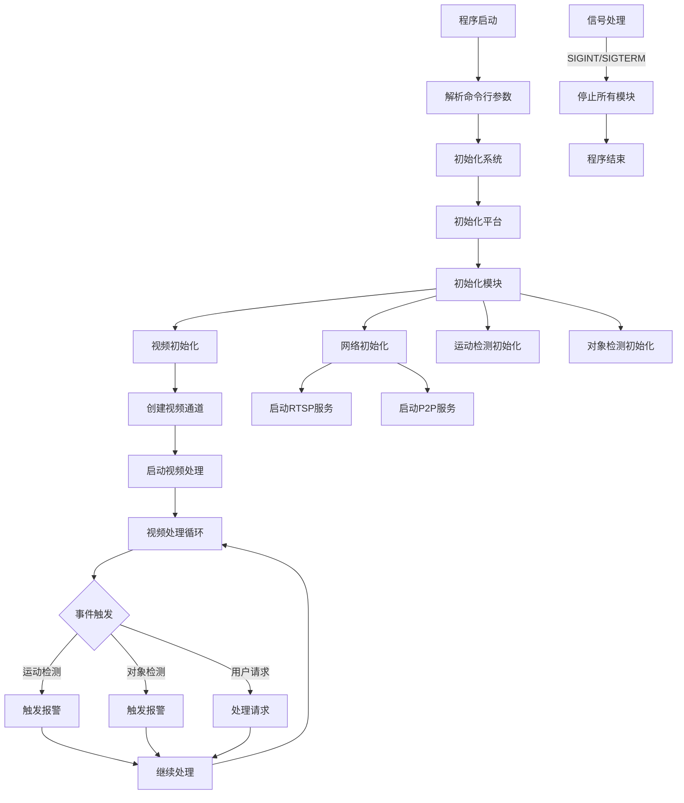
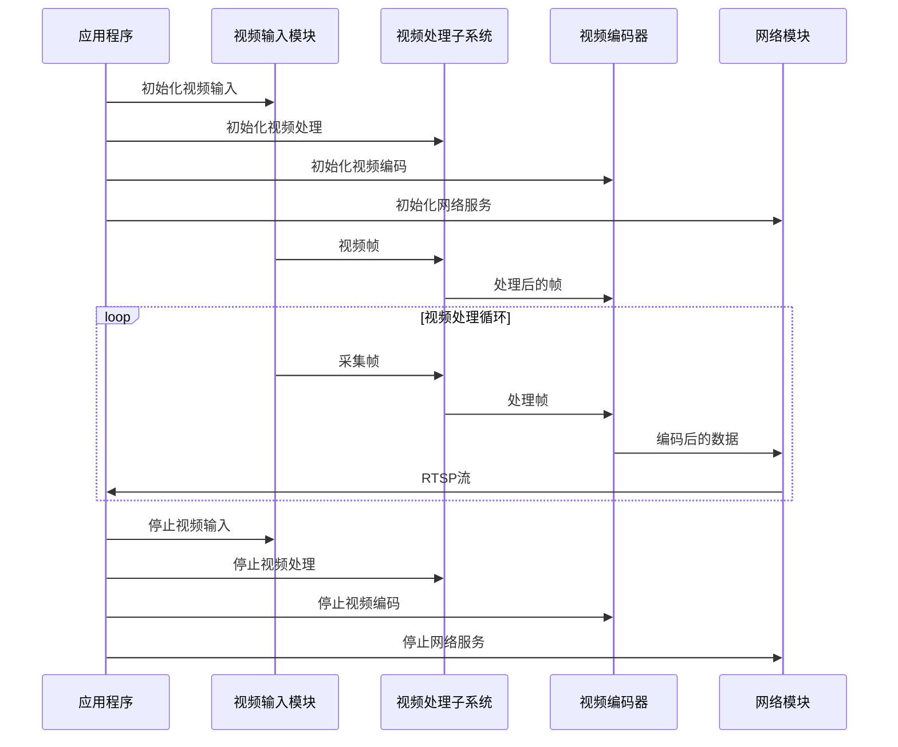
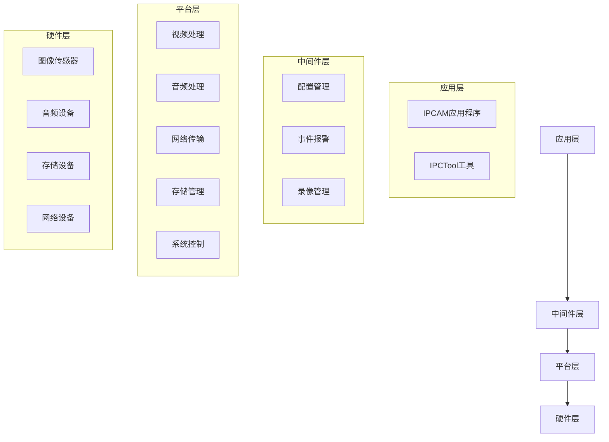

# IPCAM (IP Camera) 应用程序

## 项目概述 (Project Overview)

IPCAM 是 AR9341 SDK 的一个应用程序，用于实现网络摄像机的核心功能。该应用程序集成了视频采集、处理、编码、传输和显示等功能，支持多种图像传感器和视频处理能力，可用于构建专业级 IP 摄像机产品。

本项目提供了完整的 IP 摄像机解决方案，包括：
- 多种传感器支持 (IMX307, IMX415, IMX464, SC230AI, OV04A10 等)
- 视频处理和编码
- 网络传输 (RTSP 流媒体服务)
- 运动检测 (MD) 和对象检测 (OD)
- 音频处理
- GPIO 控制
- 系统控制和管理

## 项目结构 (Project Structure)

```
arprj/apps/ipcam/
├── Makefile                 # 项目构建文件
├── Makefile.param           # 构建参数配置
├── ipc/                     # 核心实现目录
│   ├── inc/                 # 头文件目录
│   │   ├── ipc_ctrl.h       # 系统控制接口
│   │   ├── ipc_gpio.h       # GPIO 控制接口
│   │   ├── ipc_md.h         # 运动检测接口
│   │   ├── ipc_net.h        # 网络功能接口
│   │   ├── ipc_od.h         # 对象检测接口
│   │   ├── ipc_rtsp.h       # RTSP 流媒体接口
│   │   ├── ipc_tool.h       # 工具函数接口
│   │   └── ipc_video.h      # 视频处理接口
│   └── src/                 # 源代码目录
│       ├── ipc_ctrl.c       # 系统控制实现
│       ├── ipc_gpio.c       # GPIO 控制实现
│       ├── ipc_main.c       # 主程序入口
│       ├── ipc_md.c         # 运动检测实现
│       ├── ipc_net.c        # 网络功能实现
│       ├── ipc_od.c         # 对象检测实现
│       ├── ipc_tool.c       # 工具函数实现
│       └── ipc_video.c      # 视频处理实现
├── ipctool/                 # IPC 工具目录
│   ├── Makefile             # 工具构建文件
│   ├── ar_ipctool           # 编译后的工具可执行文件
│   ├── ipctool_client_handler.c # 客户端处理实现
│   ├── ipctool_client_handler.h # 客户端处理接口
│   └── main.c               # 工具主程序
└── mid/                     # 中间件目录
    └── cfg/                 # 配置文件目录
```

## 功能特性 (Features)

- **多传感器支持**: 支持多种图像传感器，包括 IMX307, IMX415, IMX464, SC230AI, OV04A10 等
- **多通道处理**: 支持多通道视频输入和处理
- **HDR 处理**: 高动态范围图像处理
- **视频编码**: 支持 H.264/H.265 编码
- **音频处理**: 支持音频采集、编码和传输
- **网络功能**: 
  - RTSP 流媒体服务
  - P2P 连接
  - WiFi 配置和管理
- **智能分析**:
  - 运动检测 (MD)
  - 对象检测 (OD)
- **存储功能**: 支持本地录像
- **系统管理**: 支持快速启动、挂起和恢复功能

## 使用方法 (Usage)

### 编译 (Compilation)

在项目根目录下执行 make 命令编译项目：

```bash
cd arprj/apps/ipcam
make
```

### 运行 (Running)

编译完成后，可以通过以下命令运行应用程序：

```bash
./ipcam [options]
```

### 命令行选项 (Command Line Options)

- `-h`: 显示帮助信息
- `-m <mode>`: 指定运行模式，支持多种传感器配置
  - 7: 单 SC230AI
  - 9: 单 IMX307 (默认)
  - 10: 双 IMX307
  - 11: 单 IMX464
  - 12: 单 IMX415
  - 更多模式请参考帮助信息
- `-p <0|1>`: 启用性能分析
- `-o <mode>`: 指定 DVP 输出模式
  - 0: VO_INTF_BT1120
  - 1: VO_INTF_LCD_16BIT
  - 2: VO_INTF_LCD_24BIT

### 示例 (Examples)

```bash
# 使用默认配置运行 (单 IMX307)
./ipcam &

# 使用 IMX415 传感器运行
./ipcam -m 12 &

# 使用 IMX307 传感器运行并启用性能分析
./ipcam -m 9 -p 1 &
```

## 工作流程 (Workflow)

以下流程图展示了 IPCAM 应用程序的基本工作流程：



## 视频处理流程 (Video Processing Flow)



## 系统架构 (System Architecture)



## 注意事项 (Notes)

1. 运行应用程序前，请确保硬件设备已正确连接
2. 部分功能可能需要特定的传感器或硬件支持
3. 配置文件位于 `/local/ipc_cfg/cfg_*.json`，若无配置文件则使用默认配置
4. 信号处理 (SIGINT, SIGTERM) 已实现，可以通过 Ctrl+C 安全退出程序
5. 支持快速启动和恢复功能，可用于低功耗场景

## 参考文档 (References)

- AR9341 SDK 文档
- 多媒体处理平台 (MPP) API 参考
- 传感器数据手册 (IMX307, IMX415, IMX464, SC230AI, OV04A10 等)
