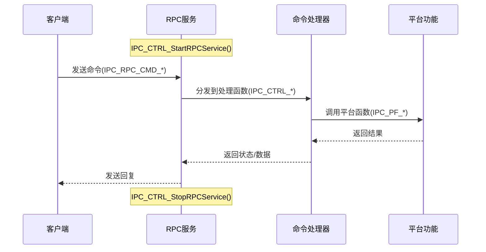

# IPCam 外部控制接口文档

## 目录

1. [概述](#概述)
2. [机制和工作流程](#机制和工作流程)
3. [命令格式](#命令格式)
4. [可用命令](#可用命令)
   - [视频输入命令](#视频输入命令)
   - [视频编码命令](#视频编码命令)
   - [录制命令](#录制命令)
   - [图像处理命令](#图像处理命令)
   - [OSD和显示命令](#osd和显示命令)
   - [系统控制命令](#系统控制命令)
   - [GPIO命令](#gpio命令)
   - [检测命令](#检测命令)

## 概述

本文档描述了IPCam应用程序的外部控制接口。该接口允许外部应用程序控制IPCam系统的各个方面，包括视频输入设置、编码参数、录制控制、图像处理和系统操作。

## 机制和工作流程

IPCam外部控制接口是作为RPC（远程过程调用）服务实现的。工作流程如下：



1. **服务初始化**：
   - IPCam进程使用`IPC_CTRL_StartRPCService()`启动RPC服务
   - 在服务初始化期间注册命令及其处理函数
   - 服务监听名为"ipc_ctrl"的binder接口上的传入RPC请求

2. **命令处理**：
   - 外部客户端连接到RPC服务并发送命令
   - 每个命令由枚举值(IPC_RPC_CMD_*)标识
   - 命令包括特定于操作的结构化参数
   - RPC服务将命令分派给适当的处理函数

3. **命令执行**：
   - 处理函数(IPC_CTRL_*)处理命令参数
   - 通过平台函数(IPC_PF_*)执行特定于平台的操作
   - 结果或状态码作为RPC回复发送回客户端

4. **服务终止**：
   - 可以使用`IPC_CTRL_StopRPCService()`停止RPC服务

## 命令格式

可以使用ipctool工具向IPCam发送命令。命令格式为：

```
<命令名> [选项]
```

例如：
```
setvifps -c 0 -f 30
```

每个命令都需要特定的参数，这些参数在下面的部分中详细描述。

## 可用命令

### 视频输入命令

#### 设置视频输入分辨率
- **命令**: `setvires`
- **描述**: 设置特定视频输入通道的分辨率
- **参数**:
  - `-c [通道]`: 视频输入通道ID
  - `-w [宽度]`: 像素宽度
  - `-h [高度]`: 像素高度
- **示例**: `setvires -c 0 -w 1920 -h 1080`

#### 设置视频输入帧率
- **命令**: `setvifps`
- **描述**: 设置特定视频输入通道的帧率
- **参数**:
  - `-c [通道]`: 视频输入通道ID
  - `-f [帧率]`: 每秒帧数
- **示例**: `setvifps -c 0 -f 30`

#### 设置防闪烁模式
- **命令**: `setviflicker`
- **描述**: 设置视频输入的防闪烁频率
- **参数**:
  - `-c [通道]`: 视频输入通道ID
  - `-f [频率]`: 频率 (0: 自动, 1: 50Hz, 2: 60Hz)
- **示例**: `setviflicker -c 0 -f 1`

#### 获取/设置3D降噪
- **命令**: `getvide3d`, `setvide3d`
- **描述**: 获取或设置3D降噪强度
- **参数**:
  - `-c [通道]`: 视频输入通道ID
  - `-s [强度]`: (仅用于设置) 强度值
- **示例**:
  - `getvide3d -c 0`
  - `setvide3d -c 0 -s 50`

#### 获取/设置2D降噪
- **命令**: `getvide2d`, `setvide2d`
- **描述**: 获取或设置2D降噪强度
- **参数**:
  - `-c [通道]`: 视频输入通道ID
  - `-s [强度]`: (仅用于设置) 强度值
- **示例**:
  - `getvide2d -c 0`
  - `setvide2d -c 0 -s 50`

#### 获取/设置曝光限制
- **命令**: `getviexplmt`, `setviexplmt`
- **描述**: 获取或设置微秒级曝光限制
- **参数**:
  - `-c [通道]`: 视频输入通道ID
  - `-e [微秒]`: (仅用于设置) 微秒级曝光限制
- **示例**:
  - `getviexplmt -c 0`
  - `setviexplmt -c 0 -e 33000`

#### 设置WDR模式
- **命令**: `setviwdr`
- **描述**: 启用或禁用宽动态范围模式
- **参数**:
  - `-c [通道]`: 视频输入通道ID
  - `-en [0/1]`: 0表示禁用，1表示启用
- **示例**: `setviwdr -c 0 -en 1`

#### 获取3A信息
- **命令**: `getvi3a`
- **描述**: 获取自动曝光、自动聚焦和自动白平衡信息
- **参数**:
  - `-c [通道]`: 视频输入通道ID
- **示例**: `getvi3a -c 0`

#### 转储YUV数据
- **命令**: `dumpyuv`
- **描述**: 从视频输入通道转储YUV数据
- **参数**:
  - `-c [通道]`: 视频输入通道ID
- **示例**: `dumpyuv -c 0`

### 视频编码命令

#### 设置编码器比特率控制
- **命令**: `setvencbrc`
- **描述**: 设置视频编码的比特率控制参数
- **参数**:
  - `-c [通道]`: 视频输入通道ID
  - `-s [流]`: 流ID
  - `-m [模式]`: 码率控制模式 (0: CBR固定码率, 1: VBR可变码率, 2: CVBR, 3: AVBR, 4: QPMAP, 5: FIXQP, 6: QVBR)
  - `-max [值]`: 最大比特率 (kbps)
  - `-min [值]`: 最小比特率 (kbps)
  - `-avg [值]`: 平均比特率 (kbps)
  - `-stattime [1-60]`: 统计时间间隔 (秒)
- **示例**: `setvencbrc -c 0 -s 0 -m 0 -max 4000 -min 2000 -avg 3000 -stattime 30`

#### 设置编码器GOP
- **命令**: `setvencgop`
- **描述**: 设置视频编码的图像组(GOP)大小
- **参数**:
  - `-c [通道]`: 视频输入通道ID
  - `-s [流]`: 流ID
  - `-v [值]`: GOP值
- **示例**: `setvencgop -c 0 -s 0 -v 30`

#### 设置编码器类型
- **命令**: `setvenctype`
- **描述**: 设置视频流的编码类型
- **参数**:
  - `-c [通道]`: 视频输入通道ID
  - `-s [流]`: 流ID
  - `-t [类型]`: 编码类型 (1: H.264, 2: H.265, 3: MJPEG)
- **示例**: `setvenctype -c 0 -s 0 -t 2`

#### 设置编码器帧率
- **命令**: `setvencfps`
- **描述**: 设置视频编码的帧率
- **参数**:
  - `-c [通道]`: 视频输入通道ID
  - `-s [流]`: 流ID
  - `-f [帧率]`: 每秒帧数
- **示例**: `setvencfps -c 0 -s 0 -f 30`

#### 设置编码器QP
- **命令**: `setvencqp`
- **描述**: 设置视频编码的量化参数
- **参数**:
  - `-c [通道]`: 视频输入通道ID
  - `-s [流]`: 流ID
  - `-minQpI [qp]`: I帧的最小量化参数
  - `-maxQpI [qp]`: I帧的最大量化参数
  - `-minQpP [qp]`: P帧的最小量化参数
  - `-maxQpP [qp]`: P帧的最大量化参数
- **示例**: `setvencqp -c 0 -s 0 -minQpI 20 -maxQpI 40 -minQpP 22 -maxQpP 42`

#### 获取编码器参数
- **命令**: `getvencparam`
- **描述**: 获取当前编码器参数
- **参数**:
  - `-c [通道]`: 视频输入通道ID
  - `-s [流id]`: 流ID
- **示例**: `getvencparam -c 0 -s 0`

### 录制命令

#### 开始/停止视频录制
- **命令**: `setvrecord`
- **描述**: 开始或停止视频录制
- **参数**:
  - `-c [通道]`: 视频输入通道ID
  - `-s [流]`: 流ID
  - `-start [0/1]`: 0表示停止，1表示开始
  - `-path [文件路径]`: 保存录制文件的路径（开始时必需）
- **示例**: `setvrecord -c 0 -s 0 -start 1 -path /tmp/record.mp4`

#### 开始/停止音频录制
- **命令**: `setarecord`
- **描述**: 开始或停止音频录制
- **参数**:
  - `-start [0/1]`: 0表示停止，1表示开始
  - `-path [文件路径]`: 保存录制文件的路径（开始时必需）
  - `-s [流]`: 流ID
- **示例**: `setarecord -start 1 -path /tmp/audio.aac -s 0`

#### 拍摄快照
- **命令**: `snapshot`
- **描述**: 从视频通道拍摄快照
- **参数**:
  - `-c [通道]`: 视频输入通道ID
  - `-path [文件路径]`: 保存快照的路径
- **示例**: `snapshot -c 0 -path /tmp/snapshot.jpg`

#### 开始/停止回放
- **命令**: `setplayback`
- **描述**: 控制视频回放
- **参数**:
  - `-start [0/1]`: 0表示停止，1表示开始
  - `-path [文件路径]`: 媒体文件的路径（开始时必需）
  - `-loop [0/1]`: 0表示单次播放，1表示循环播放
- **示例**: `setplayback -start 1 -path /tmp/video.mp4 -loop 0`

### 图像处理命令

#### 设置图像场景
- **命令**: `setimsgescene`
- **描述**: 设置图像场景模式
- **参数**:
  - `-c [通道]`: 视频输入通道ID
  - `-m [0/1]`: 0表示日模式，1表示夜模式
  - `-f [调优文件名]`: 调优文件名
- **示例**: `setimsgescene -c 0 -m 0 -f day_tune.json`
- **Description**: Sets the image scene mode
- **Parameters**:
  - `-c [channel]`: Video input channel ID
  - `-m [0|1]`: 0 for day mode, 1 for night mode
  - `-f [tunning name]`: Name of the tuning file
- **Example**: `setimsgescene -c 0 -m 0 -f day_tune.json`

#### Set Image Style
- **Command**: `setimagestyle`
- **Description**: Sets the image style
- **Parameters**:
  - `-c [channel]`: Video input channel ID
  - `-m [0|1]`: 0 for normal, 1 for bright
- **Example**: `setimagestyle -c 0 -m 0`

#### Flip Image
- **Command**: `setflip`
- **Description**: Enables or disables image flipping
- **Parameters**:
  - `-c [channel]`: Video input channel ID
  - `-en [0|1]`: 0 to disable, 1 to enable
- **Example**: `setflip -c 0 -en 1`

#### Mirror Image
- **Command**: `setmirror`
- **Description**: Enables or disables image mirroring
- **Parameters**:
  - `-c [channel]`: Video input channel ID
  - `-en [0|1]`: 0 to disable, 1 to enable
- **Example**: `setmirror -c 0 -en 1`

#### Get/Set Image Parameters

##### Brightness
- **Commands**: `getbright`, `setbright`
- **Parameters**:
  - `-c [channel]`: Video input channel ID
  - `-v [value]`: (For set only) Brightness value
- **Examples**: 
  - `getbright -c 0`
  - `setbright -c 0 -v 50`

##### Contrast
- **Commands**: `getcontrast`, `setcontrast`
- **Parameters**:
  - `-c [channel]`: Video input channel ID
  - `-v [value]`: (For set only) Contrast value
- **Examples**: 
  - `getcontrast -c 0`
  - `setcontrast -c 0 -v 50`

##### Saturation
- **Commands**: `getsaturation`, `setsaturation`
- **Parameters**:
  - `-c [channel]`: Video input channel ID
  - `-v [value]`: (For set only) Saturation value
- **Examples**: 
  - `getsaturation -c 0`
  - `setsaturation -c 0 -v 50`

##### Sharpness
- **Commands**: `getsharpness`, `setsharpness`
- **Parameters**:
  - `-c [channel]`: Video input channel ID
  - `-v [value]`: (For set only) Sharpness value
- **Examples**: 
  - `getsharpness -c 0`
  - `setsharpness -c 0 -v 50`

##### Hue
- **Commands**: `gethue`, `sethue`
- **Parameters**:
  - `-c [channel]`: Video input channel ID
  - `-v [value]`: (For set only) Hue value
- **Examples**: 
  - `gethue -c 0`
  - `sethue -c 0 -v 50`

### OSD and Display Commands

#### Draw OSD
- **Command**: `drawosd`
- **Description**: Draws an on-screen display
- **Parameters**:
  - `-g [vpss grp]`: VPSS group ID
  - `-iw [img width]`: Image width
  - `-ih [img height]`: Image height
  - `-s [string]`: String to display
  - `-sc [RGB]`: String color in RGB format
  - `-rect`: Flag to draw rectangle
  - `-rc [RGB]`: Rectangle color in RGB format
- **Example**: `drawosd -g 0 -iw 1920 -ih 1080 -s "IPCam" -sc 0xFF0000 -rect -rc 0x00FF00`

#### Clear OSD
- **Command**: `clearosd`
- **Description**: Clears all on-screen displays
- **Parameters**:
  - `-g [vpss grp]`: VPSS group ID
- **Example**: `clearosd -g 0`

#### Set Stream OSD
- **Command**: `setstreamosd`
- **Description**: Sets OSD for a specific stream
- **Parameters**:
  - `-c [channel]`: Video input channel ID
  - `-s [stream]`: Stream ID
  - `-name [string]`: Text to display
  - `-r [RGB]`: Text color in RGB format
  - `-ce [0|1]`: Enable/disable channel ID display
  - `-te [0|1]`: Enable/disable timestamp display
  - `-tf [0-5]`: Timestamp format
  - `-df [0|1]`: Enable/disable date format
  - `-we [0|1]`: Enable/disable week display
  - `-f [fontid]`: Font ID
- **Example**: `setstreamosd -c 0 -s 0 -name "Channel 0" -r 0xFF0000 -ce 1 -te 1 -tf 0 -df 0 -we 1 -f 0`

#### Set VPSS Flip/Mirror
- **Commands**: `setvpssflip`, `setvpssmirror`
- **Description**: Sets flip or mirror mode for VPSS channel
- **Parameters**:
  - `-g [group]`: VPSS group ID
  - `-c [channel]`: VPSS channel ID
  - `-en [0|1]`: 0 to disable, 1 to enable
- **Examples**:
  - `setvpssflip -g 0 -c 0 -en 1`
  - `setvpssmirror -g 0 -c 0 -en 1`

#### Set VO Fullscreen
- **Command**: `vofullscreen`
- **Description**: Sets a video output channel to fullscreen mode
- **Parameters**:
  - `-c [vo chn]`: VO channel ID
  - `-en [0|1]`: 0 to disable, 1 to enable fullscreen
- **Example**: `vofullscreen -c 0 -en 1`

### System Control Commands

#### Watchdog Control
- **Command**: `setwdt`
- **Description**: Controls the system watchdog timer
- **Parameters**:
  - `-power [0|1]`: 0 to disable, 1 to enable the watchdog
- **Example**: `setwdt -power 1`

#### SVP Control
- **Command**: `setsvp`
- **Description**: Controls the Smart Vision Processing unit
- **Parameters**:
  - `-power [0|1]`: 0 to power off, 1 to power on
- **Example**: `setsvp -power 1`

#### Wi-Fi Mode
- **Command**: `setwifimode`
- **Description**: Sets the Wi-Fi operating mode
- **Parameters**:
  - `-m [mode]`: Wi-Fi mode
- **Example**: `setwifimode -m 1`

#### System Reboot
- **Command**: `sysreboot`
- **Description**: Reboots the system
- **Parameters**:
  - `-reboot [flag]`: Reboot flag
- **Example**: `sysreboot -reboot 1`

#### System Power Off
- **Command**: `syspoweroff`
- **Description**: Powers off the system
- **Parameters**:
  - `-power [flag]`: Power off flag
- **Example**: `syspoweroff -power 1`

### GPIO Commands

#### Set GPIO
- **Command**: `setgpio`
- **Description**: Sets the state of a GPIO pin
- **Parameters**:
  - `-n [name]`: GPIO name (e.g., "A0_0")
  - `-d [0|1]`: 0 for input, 1 for output direction
  - `-v [0|1]`: Value to set (for output direction)
- **Example**: `setgpio -n A0_0 -d 1 -v 1`

#### Get GPIO
- **Command**: `getgpio`
- **Description**: Gets the current state of a GPIO pin
- **Parameters**:
  - `-n [name]`: GPIO name (e.g., "A0_0")
- **Example**: `getgpio -n A0_0`

### Detection Commands

#### Motion Detection
- **Command**: `setmd`
- **Description**: Enables or disables motion detection
- **Parameters**:
  - `-en [0|1]`: 0 to disable, 1 to enable
- **Example**: `setmd -en 1`

#### Object Detection
- **Command**: `setod`
- **Description**: Enables or disables object detection
- **Parameters**:
  - `-en [0|1]`: 0 to disable, 1 to enable
- **Example**: `setod -en 1`

### General Control Commands

#### Start
- **Command**: `start`
- **Description**: Starts elements from the configuration file
- **Example**: `start`

#### Stop
- **Command**: `stop`
- **Description**: Stops elements from the configuration file
- **Example**: `stop`

#### Create
- **Command**: `create`
- **Description**: Used for testing IPC_AV_Init
- **Example**: `create`

#### Destroy
- **Command**: `destory` (note: misspelled in the code)
- **Description**: Used for testing IPC_AV_UnInit
- **Example**: `destory`

## Additional Information

### Using the ipctool Utility

The ipctool utility provides a command-line interface for sending commands to the IPCam process. To use it:

1. Launch the ipctool utility
2. Enter commands at the prompt
3. Use 'help' to see a list of available commands
4. Use 'exit' to quit the utility

### RPC Command Protocol

Internally, each command is mapped to an RPC command ID (IPC_RPC_CMD_*) defined in the IPCam code. When a command is sent, the following occurs:

1. Command parameters are parsed and converted to a structure
2. The structure is sent to the IPCam process via RPC
3. A handler function in the IPCam process processes the command
4. Results or status codes are returned to the client

### Error Handling

Most commands will return a status code indicating success (0) or failure (non-zero). In case of failure, error messages may be displayed in the system logs.
