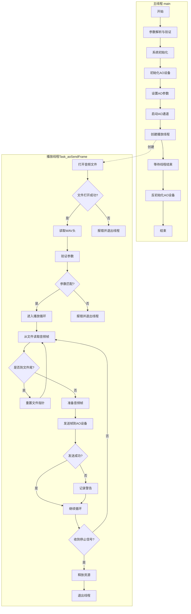

# 音频播放流程图

## 流程说明

### 主线程流程 (main函数)
1. **参数解析与验证**
   - 函数: `main()`, `check_param()`
   - 处理命令行参数，设置音频参数（采样率、位宽、声道等）

2. **系统初始化**
   - 函数: `AR_MPI_VB_Init()`, `AR_MPI_SYS_Init()`
   - 初始化视频缓冲区和MPP系统

3. **AO设备初始化**
   - 函数: `Module_AO_Init()`
   - 设置AO设备参数: `AR_MPI_AO_SetPubAttr()`
   - 启用AO设备: `AR_MPI_AO_Enable()`
   - 启用AO通道: `AR_MPI_AO_EnableChn()`
   - 设置音量: `Module_AO_SetVolume()`

4. **创建播放线程**
   - 函数: `pthread_create()` 创建 `Task_aoSendFrame` 线程
   - 设置线程分离属性

5. **等待线程结束**
   - 函数: `pthread_join()` 或等待信号
   - 清理资源: `Module_AO_DeInit()`

### 播放线程流程 (Task_aoSendFrame函数)
1. **打开音频文件**
   - 函数: `fopen()` 打开指定路径的音频文件
   - 错误处理: 检查文件是否成功打开

2. **解析WAV头（如果是WAV文件）**
   - 函数: `fread()` 读取WAV头
   - 辅助函数: `readWaveHeader()` 解析头信息
   - 输出音频信息: 采样率、位宽、声道数等

3. **参数验证**
   - 检查WAV文件参数是否与系统配置匹配
   - 验证采样率: `eSampleRate == pstWaveHeader.wave.dwSamplesPerSec`
   - 验证位宽: `eBitWidth` 与 `pstWaveHeader.wave.wBitsPerSample`
   - 验证声道数: `eSoundMode` 与 `(pstWaveHeader.wave.wChannels-1)`
   - 不匹配则打印错误并退出线程

4. **进入播放循环**
   - 循环条件: `while (!bAoExit)`
   - 从文件读取音频数据: `fread()`
   - 检查文件结束: `feof()`
     - 如果到达文件尾: 重置文件指针到数据开始位置
     - 如果是WAV文件: `fseek(s32Fd, 44, SEEK_SET)`
     - 如果是原始PCM: `fseek(s32Fd, 0, SEEK_SET)`
     - 继续下一轮循环

5. **发送音频帧**
   - 准备音频帧结构: 设置数据指针、大小、时间戳等
   - 发送帧: `AR_MPI_AO_SendFrame()`
   - 错误处理:
     - 发送失败时打印警告
     - 释放VB块: `AR_MPI_VB_ReleaseBlock()`
     - 继续下一轮循环

6. **线程退出处理**
   - 当 `bAoExit` 为真时退出循环
   - 关闭文件: `fclose()`
   - 释放资源: `AR_MPI_VB_ReleaseBlock()` 如果有未释放的块
   - 线程结束

### 关键点说明
1. **循环播放**：
   - 默认情况下，音频会循环播放直到 `bAoExit` 被设置为真
   - 文件指针会在到达文件尾时重置到数据开始位置

2. **错误处理**：
   - 文件打开失败：线程立即退出
   - 参数不匹配：打印错误信息后线程退出
   - 发送帧失败：打印警告，继续下一帧

3. **资源管理**：
   - AO设备的初始化和释放由主线程管理
   - 文件操作和VB块管理由播放线程负责
   - 确保所有分配的资源在退出时被正确释放

## 错误处理

### 文件操作错误
- **文件打开失败**: 线程立即退出并报错
- **文件读取错误**: 记录警告并继续尝试读取下一帧
- **文件结束处理**: 重置文件指针到开始位置，实现循环播放

### 参数验证错误
- **参数不匹配**: 比较WAV头信息与系统配置
  - 采样率不匹配: 报错并退出线程
  - 位宽不匹配: 报错并退出线程
  - 声道数不匹配: 报错并退出线程

### 音频设备错误
- **帧发送失败**: 记录警告并继续处理下一帧
- **设备初始化失败**: 主线程报错并终止程序
- **资源分配失败**: 记录错误并尝试优雅降级或退出

### 资源管理
- 所有打开的文件句柄在退出时关闭
- 分配的VB块在不再需要时释放
- 线程安全地检查退出标志
- 主线程负责AO设备的初始化和清理
- 播放线程负责文件操作和帧处理
