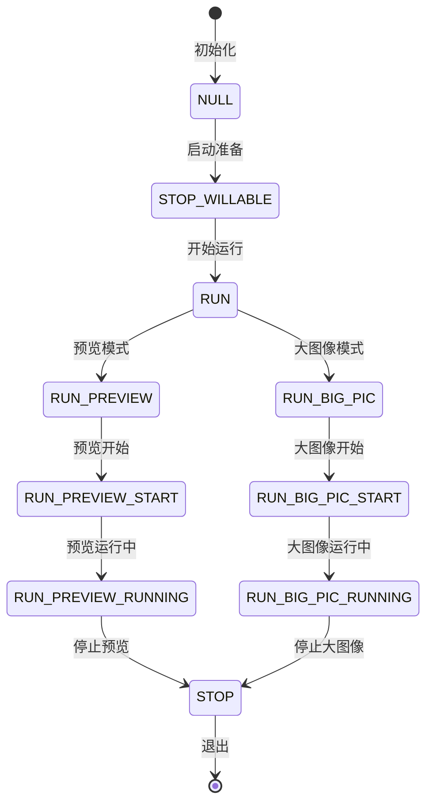

# Big Pic Demo Server模式完整指南

## 概述

Big Pic Demo Server模式是一个基于命名管道的高性能图像处理服务器架构，专门为专业级相机控制和图像采集而设计。通过`./test_mpp_vio -index 46 -server`命令启动，提供完整的远程控制能力和灵活的图像处理管道。

## 🎯 核心功能

### 1. 多模式操作
- **实时预览**: 连续视频流输出
- **单帧拍摄**: 精确控制的图像捕获
- **多帧序列**: 批量图像采集
- **高分辨率模式**: 大图像拼接与处理

### 2. 进程间通信
- **命名管道**: `/tmp/cmd_pipe` 作为控制接口
- **状态机驱动**: 21个状态的完整生命周期管理
- **异步控制**: 支持并发命令处理

### 3. 高级图像处理
- **3A实时控制**: 自动曝光、白平衡、对焦
- **多分辨率支持**: 1080P ↔ 8K动态切换
- **格式转换**: RAW ↔ YUV ↔ JPEG

## 🚀 快速开始

### 启动服务器
```bash
# 启动Server模式
./test_mpp_vio -index 46 -server

# 后台启动
./test_mpp_vio -index 46 -server &

# 指定参数启动
./test_mpp_vio -index 46 -server -video 1 -res 1080 -hdr
```

### 基本控制命令
```bash
# 打开控制管道
exec 3<> /tmp/cmd_pipe

# 开始实时预览
echo "preview" >&3

# 拍摄单帧图片
echo "take 1" >&3

# 拍摄10帧序列
echo "take 10" >&3

# 进入高分辨率模式
echo "bigpic" >&3

# 停止所有操作
echo "stop" >&3

# 关闭管道
exec 3>&-
```

## 🔧 命令详解

### 控制命令列表

| 命令 | 参数 | 功能描述 | 响应时间 |
|------|------|----------|----------|
| `preview` | - | 开始实时预览 | <1秒 |
| `take` | `[n]` | 拍摄n帧图片 | <2秒 |
| `bigpic` | - | 高分辨率拍摄 | <3秒 |
| `stop` | - | 停止当前操作 | <1秒 |
| `status` | - | 查询当前状态 | <100ms |

### 状态机说明



## 📂 文件结构

### 配置文件
```
/etc/bigpic.conf          # 全局配置
/tmp/bigpic.pid           # 进程PID文件
/tmp/cmd_pipe             # 控制命名管道
```

### 输出目录
```
/sdcard/bigpic/
├── raw/
│   ├── preview_YYYYMMDD_HHMMSS.raw
│   ├── bigpic_YYYYMMDD_HHMMSS.raw
│   └── sequence_YYYYMMDD_HHMMSS_N.raw
├── yuv/
│   ├── preview_YYYYMMDD_HHMMSS.yuv
│   └── bigpic_YYYYMMDD_HHMMSS.yuv
├── jpg/
│   └── preview_YYYYMMDD_HHMMSS.jpg
└── log/
    └── bigpic_YYYYMMDD.log
```

## 🛠️ 技术架构

### 线程模型
```
Main Thread (Server)
├── Command Listener
├── State Machine
├── Camera Controller
└── File Manager

Worker Threads
├── Preview Thread
├── Capture Thread
├── Display Thread
└── Save Thread
```

### 内存管理
- **缓冲池**: 动态内存分配
- **零拷贝**: 减少数据复制
- **DMA传输**: 硬件加速
- **缓存优化**: CPU友好访问

## 📊 性能参数

### 资源消耗
| 模式 | 内存(MB) | CPU(%) | 存储(MB/s) | 网络带宽 |
|------|----------|--------|------------|----------|
| 预览 | 100-150 | 15-25 | 0 | 无 |
| 拍摄 | 200-300 | 25-35 | 50-200 | 无 |
| 大图像 | 500-800 | 40-60 | 200-500 | 无 |

### 延迟指标
- **命令响应**: <100ms
- **模式切换**: <2秒
- **图像捕获**: <500ms
- **文件保存**: <1秒

## 🔍 高级用法

### 自定义配置
```bash
# 指定传感器类型
./test_mpp_vio -index 46 -server -video 1 -res 1080

# HDR模式
./test_mpp_vio -index 46 -server -video 1 -res 1080 -hdr

# 文件输入模式
./test_mpp_vio -index 46 -server -dir /sdcard/images/

# 网络存储
./test_mpp_vio -index 46 -server -output /mnt/network/
```

### Python控制示例
```python
#!/usr/bin/env python3
import os
import time
import subprocess

class BigPicServer:
    def __init__(self):
        self.pipe_path = "/tmp/cmd_pipe"
        self.ensure_pipe()
    
    def ensure_pipe(self):
        if not os.path.exists(self.pipe_path):
            os.mkfifo(self.pipe_path)
    
    def send_command(self, cmd):
        with open(self.pipe_path, 'w') as f:
            f.write(cmd + '\n')
    
    def preview(self):
        self.send_command("preview")
    
    def take(self, count=1):
        self.send_command(f"take {count}")
    
    def bigpic(self):
        self.send_command("bigpic")
    
    def stop(self):
        self.send_command("stop")

# 使用示例
if __name__ == "__main__":
    server = BigPicServer()
    
    # 启动预览
    server.preview()
    time.sleep(5)
    
    # 拍摄5张照片
    server.take(5)
    time.sleep(10)
    
    # 停止
    server.stop()
```

### C语言控制示例
```c
#include <stdio.h>
#include <string.h>
#include <unistd.h>
#include <fcntl.h>

int send_command(const char* cmd) {
    int fd = open("/tmp/cmd_pipe", O_WRONLY);
    if (fd < 0) {
        perror("open pipe");
        return -1;
    }
    
    write(fd, cmd, strlen(cmd));
    close(fd);
    return 0;
}

int main() {
    send_command("preview");
    sleep(5);
    send_command("take 3");
    sleep(3);
    send_command("stop");
    return 0;
}
```

## 🔧 故障排除

### 常见问题

#### 1. 管道无法创建
```bash
# 检查权限
ls -la /tmp/cmd_pipe

# 手动创建
mkfifo /tmp/cmd_pipe
chmod 666 /tmp/cmd_pipe
```

#### 2. 命令无响应
```bash
# 检查进程状态
ps aux | grep test_mpp_vio

# 查看日志
tail -f /tmp/bigpic.log

# 重启服务
killall test_mpp_vio
./test_mpp_vio -index 46 -server
```

#### 3. 文件保存失败
```bash
# 检查存储空间
df -h

# 检查权限
ls -la /sdcard/bigpic/

# 手动创建目录
mkdir -p /sdcard/bigpic/{raw,yuv,jpg}
```

### 调试工具
```bash
# 实时监控
tail -f /tmp/bigpic.log

# 状态查询
echo "status" > /tmp/cmd_pipe

# 性能监控
top -p $(pgrep test_mpp_vio)

# 内存检查
cat /proc/$(pgrep test_mpp_vio)/status
```

## 🎯 应用场景

### 1. 专业摄影系统
- **远程控制**: 通过脚本控制专业相机
- **批量拍摄**: 自动化产品摄影
- **延时摄影**: 定时图像采集

### 2. 工业检测
- **质量监控**: 生产线实时检测
- **缺陷识别**: 高分辨率图像分析
- **自动化测试**: 无人值守监控

### 3. 科研应用
- **长时间观测**: 天体/生物观察
- **实验记录**: 精确时序数据采集
- **数据分析**: 原始图像保存

### 4. 安防监控
- **智能触发**: 运动检测拍照
- **事件记录**: 异常情况自动捕获
- **远程监控**: 网络控制相机系统

## 📈 扩展开发

### 网络接口
```python
# 基于HTTP的REST API
from flask import Flask, request
import subprocess

app = Flask(__name__)

@app.route('/preview')
def preview():
    subprocess.run(['echo', 'preview'], stdout=open('/tmp/cmd_pipe', 'w'))
    return {'status': 'ok'}

@app.route('/take/<int:count>')
def take(count):
    subprocess.run(['echo', f'take {count}'], stdout=open('/tmp/cmd_pipe', 'w'))
    return {'status': 'ok', 'count': count}

if __name__ == '__main__':
    app.run(host='0.0.0.0', port=5000)
```

### 数据库集成
```python
import sqlite3
import json
from datetime import datetime

class ImageDatabase:
    def __init__(self, db_path):
        self.conn = sqlite3.connect(db_path)
        self.create_table()
    
    def create_table(self):
        self.conn.execute('''
            CREATE TABLE IF NOT EXISTS images (
                id INTEGER PRIMARY KEY AUTOINCREMENT,
                timestamp TEXT,
                filename TEXT,
                type TEXT,
                width INTEGER,
                height INTEGER,
                metadata TEXT
            )
        ''')
    
    def add_image(self, filename, img_type, width, height, metadata):
        self.conn.execute(
            'INSERT INTO images (timestamp, filename, type, width, height, metadata) VALUES (?, ?, ?, ?, ?, ?)',
            (datetime.now().isoformat(), filename, img_type, width, height, json.dumps(metadata))
        )
        self.conn.commit()
```

## 🔗 相关文档

- [VIO命令行参数详解](commands.md)
- [Index功能详解](index_functions.md)
- [传感器适配指南](sensor_guide.md)
- [性能优化手册](performance_tuning.md)

---

**技术支持**: 如需更多帮助，请参考项目README.md或联系技术支持团队。