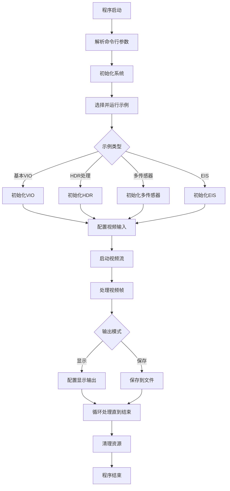
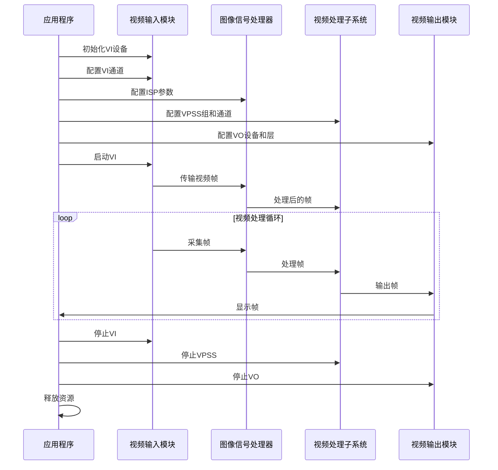
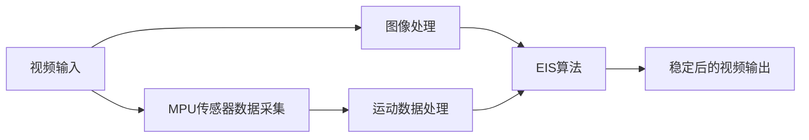
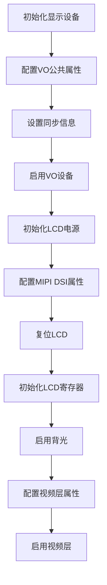
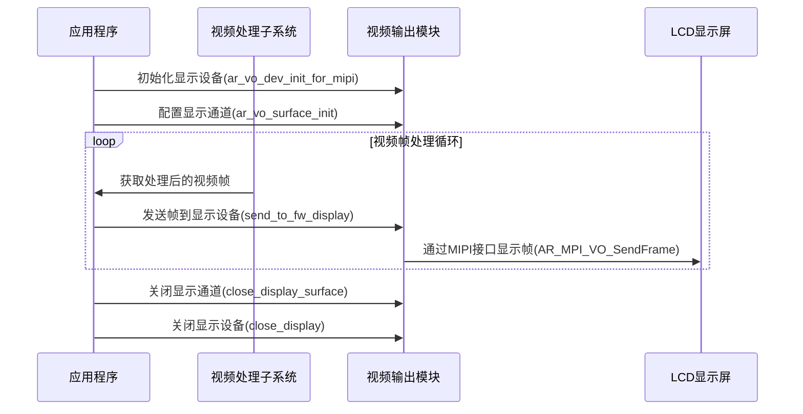

# VIO (Video Input/Output) Sample Project

## 项目概述 (Project Overview)

VIO (Video Input/Output) 示例项目是 AR9341 SDK 的一部分，提供了一系列用于视频输入和输出处理的示例代码。该项目演示了如何使用 AR9341 SDK 中的多媒体处理平台 (MPP) 功能进行视频采集、处理和显示。

本项目包含多个示例，涵盖了不同的视频处理场景，如：
- 单传感器和多传感器配置
- HDR (高动态范围) 处理
- 电子图像稳定 (EIS)
- 视频帧处理和绑定
- 多种传感器支持 (IMX307, IMX415, OS04A10 等)

## 项目结构 (Project Structure)

```
arprj/apps/mpp_sample/vio/
├── Makefile                 # 项目构建文件
├── sample_vio.h             # 主要头文件，定义了VIO示例的结构和接口
├── sample_vio_main.c        # 主程序入口，包含命令行解析和示例选择
├── smp/                     # 示例实现目录
│   ├── sample_eis.c         # 电子图像稳定 (EIS) 示例实现
│   ├── sample_eis.h         # EIS 示例头文件
│   ├── sample_eis_mpu.c     # EIS MPU 实现
│   ├── sample_eis_mpu.h     # EIS MPU 头文件
│   ├── sample_eis_mpu6509.c # EIS MPU6509 特定实现
│   ├── sample_vio.c         # VIO 示例核心实现
│   ├── sample_vio_big_pic.c # 大图像处理示例
│   ├── sample_vio_big_pic.h # 大图像处理头文件
│   ├── sample_vio_big_pic_fifo.c # 大图像处理FIFO实现
│   ├── sample_vio_imx307_dvpcolorbar.c # IMX307 DVP彩条示例
│   ├── sample_vio_sof_lowdeay.c # SOF低延迟示例
```

## 功能特性 (Features)

- **多传感器支持**: 支持多种图像传感器，包括 IMX307, IMX415, OS04A10, GC2093 等
- **多通道处理**: 支持多通道视频输入和处理
- **HDR 处理**: 高动态范围图像处理
- **电子图像稳定 (EIS)**: 通过 MPU 传感器数据实现视频稳定
- **视频帧处理**: 包括裁剪、缩放等操作
- **多种输出模式**: 支持 HDMI 和 MIPI 显示输出
- **绑定模式**: 支持不同模块间的数据绑定，提高处理效率
- **原始数据处理**: 支持获取和处理原始传感器数据

## 使用方法 (Usage)

### 编译 (Compilation)

在项目根目录下执行 make 命令编译项目：

```bash
cd arprj/apps/mpp_sample/vio
make
```

### 运行 (Running)

编译完成后，可以通过以下命令运行示例：

```bash
./test_mpp_vio -index <示例索引> [其他参数]
```

### 示例索引 (Example Indices)

项目提供了多种示例，可以通过 `-index` 参数指定要运行的示例：

- 12: SAMPLE_VIO_Only - 基本VIO示例
- 13: SAMPLE_VIO_Only_Hdr - HDR处理示例
- 14: SAMPLE_VIO_Only_2Ch - 双通道示例
- 15: SAMPLE_VIO_Only_For_Bind - 绑定模式示例
- 更多示例请参考 `sample_vio_main.c` 中的 `SAMPLE_VIO_Usage` 函数

### 其他参数 (Other Parameters)

- `-vo`: 指定输出设备 (0: HDMI, 1: MIPI)
- `-nframes`: 指定处理的帧数
- `-cam_mode`: 相机模式 (0: online, 1: offline, 2: multi)
- `-dpcm`: DPCM设置 (0: 默认, 1: 启用, 2: 禁用)
- 更多参数请参考 `sample_vio_main.c` 中的 `SAMPLE_VIO_Usage` 函数

## 工作流程 (Workflow)

以下流程图展示了 VIO 示例的基本工作流程：



## 典型处理流程 (Typical Processing Flow)



## 电子图像稳定 (EIS) 流程



## LCD视频帧输出流程 (LCD Video Frame Output Process)

本节详细说明了VIO项目中视频帧如何输出到LCD屏幕的过程。

### LCD显示初始化流程



### 视频帧发送流程



### 关键组件和函数

1. **显示设备初始化**
   - `ar_vo_dev_init_for_mipi`: 初始化MIPI显示设备，配置分辨率、帧率和同步信息
   - `ar_vo_dev_init_for_mipi_720_1440`: 针对720x1440分辨率的MIPI显示设备初始化
   - `ar_vo_dev_init`: 通用显示设备初始化

2. **LCD控制函数**
   - `power_lcd`: 控制LCD电源GPIO
   - `reset_lcd`: 控制LCD复位GPIO
   - `backlight_lcd`: 控制LCD背光GPIO或PWM
   - `init_display_st7703`: 初始化ST7703 LCD控制器

3. **视频帧发送**
   - `send_to_fw_display`: 将视频帧发送到LCD显示设备
   - `AR_MPI_VO_SendFrame`: 底层API，将帧数据发送到视频输出设备

4. **显示通道管理**
   - `ar_vo_surface_init`: 初始化显示通道，配置显示区域
   - `close_display_surface`: 关闭显示通道
   - `close_display`: 关闭整个显示设备

### 技术细节

- **MIPI DSI配置**: 项目使用MIPI DSI接口连接LCD，通过`AR_MPI_VO_Dsi_SetAttr`和`AR_MPI_VO_Dsi_Enable`配置和启用
- **LCD初始化序列**: 通过发送特定的命令序列初始化LCD控制器，如ST7703
- **GPIO控制**: 使用GPIO控制LCD的电源、复位和背光
- **视频层配置**: 配置视频层属性，包括像素格式(YVU_PLANAR_420)、显示区域和图像大小
- **帧同步**: 设置帧同步信息，确保视频输出与LCD显示同步


LCD视频帧输出主要在 sample_vio.c 文件中实现。具体来说，以下是关键部分：

#### 核心输出函数：

send_to_fw_display 函数在 arprj/apps/mpp_sample/vio/smp/sample_vio.c 中实现这个函数负责将处理好的视频帧发送到LCD显示设备显示设备初始化：
ar_vo_dev_init_for_mipi 和 ar_vo_dev_init_for_mipi_720_1440 
arprj\apps\mpp_sample\vio\smp\sample_vio.c 函数也在同一个文件中这些函数负责初始化MIPI显示设备和配置LCD参数

#### LCD控制函数：

LCD电源、复位和背光控制函数（power_lcd、reset_lcd、backlight_lcd）同样在 sample_vio.c 中LCD初始化函数 init_display_st7703 也在这个文件中
实际的帧发送过程是通过调用 AR_MPI_VO_SendFrame API来完成的，这是在 send_to_fw_display 函数内部实现的。各个示例程序（如 sample_vio_imx307_dvpcolorbar.c 等）会在处理完视频帧后调用这个函数将帧发送到LCD显示。

## 注意事项 (Notes)

1. 运行示例前，请确保硬件设备已正确连接
2. 部分示例可能需要特定的传感器或硬件支持
3. 使用 `-help` 参数查看更多命令行选项
4. 信号处理 (SIGINT, SIGTERM) 已实现，可以通过 Ctrl+C 安全退出程序

## 参考文档 (References)

- AR9341 SDK 文档
- 多媒体处理平台 (MPP) API 参考
- 传感器数据手册 (IMX307, IMX415, OS04A10 等)
